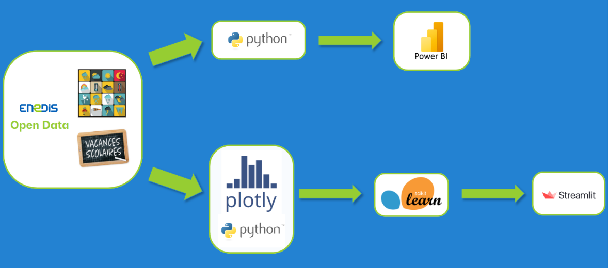

# :zap: Prediction of energy consumption

Student Project using :
 - Python for processing data
 - Power BI for the dashboard
 - Streamlit for building the web page of our solution

## :ledger: Index

 - [Subject](#beginner-subject)
 - [Product Backlogs](#dart-product-backlogs)
 - [Workflow diagram](h#wrench-tools)
 - [Steps of the project](#scroll-steps-of-the-project)
 - [Gallery](#camera-gallery)
 - [Tools](#wrench-tools)
 - [Team members](#handshake-team-members)

## :beginner: Subject

This is a school project in partnership with Enedis.
Enedis is an electricity distributor in France and wants a machine learning solution to predict consumption based on weather and calendar parameters.
The scope of the study is only for private individuals.

## :dart: Product Backlogs

The goal of the project revolves around these 2 topics :

 - **Analysis** : making a complete analysis of regional uses over time
	* overall national consumption
	* summer time versus winter time distribution
	* regional consumption versus average per capita consumption
	* typical daily consumption
	* consumption according to temperature

 - **Prediction model** : predicting consumption according to different parameters
	* Retrieve weather information (API + webscraping)
	* Retrieve calendar information
	* Train the model with existing information
	* Make a prediction based on the information retrieved beforehand

## :twisted_rightwards_arrows: Workflow diagram

## :scroll: Steps of the project

**Analysis**
 - Retrieve all data about national consumption in France
 - Checking the integrity of the data
 - Reduce the dataset to the strictly necessary data
 - Interpreting data along different axes 
 - Building the dashboard using these interpretations 

**Prediction model**
 - first kind of prediction : making a time series prediction
 - second kind of prediction : making a regression prediction
	* selecting the most relevant variables (correlation map) 
 	* from a date selected by a user, deduce :
     1. calendar information (summertime/wintertime, weekend, school holiday)
     2. weather information (API & webscraping)
 
 - Displaying the predictions results on a web page using Streamlit

## :camera: Gallery

#### Titre

#### Titre

#### Titre

## :wrench: Tools

## :handshake: Team members

 - [Anthony ETIENNE](https://github.com/Anthowheels)
 - [Emilie HEULLE](https://github.com/HeEmilie)
 - François ALBERT
 - [Alexandre CANIZAREZ](https://github.com/AlexCNZRZ)

## :lock: License

This project is licensed under the terms of the MIT.
